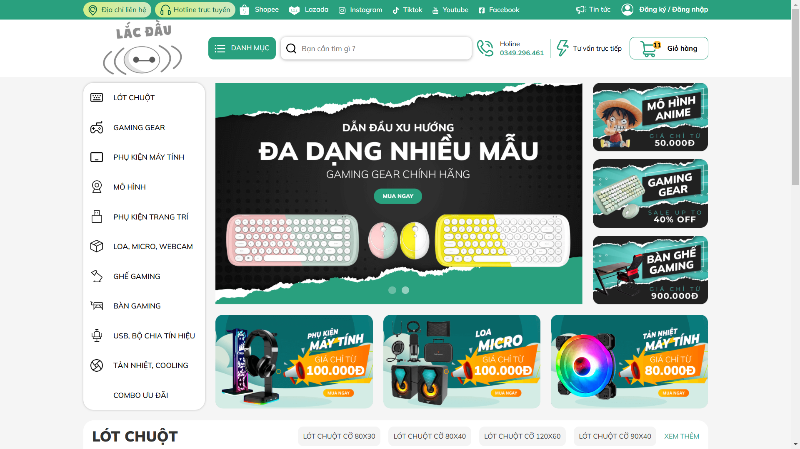
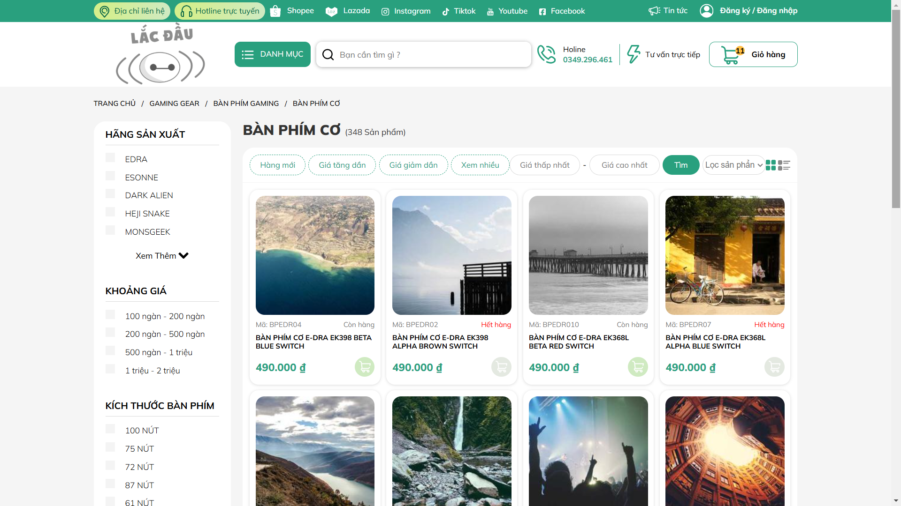
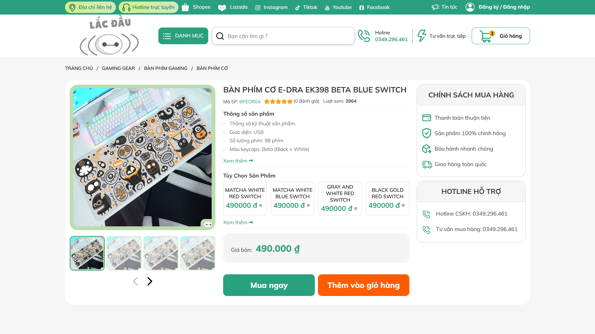
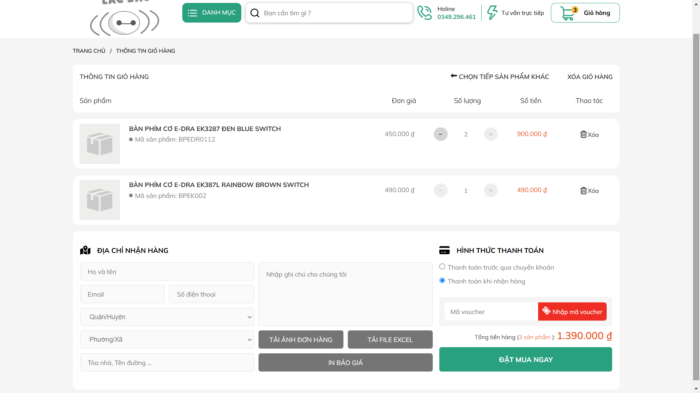
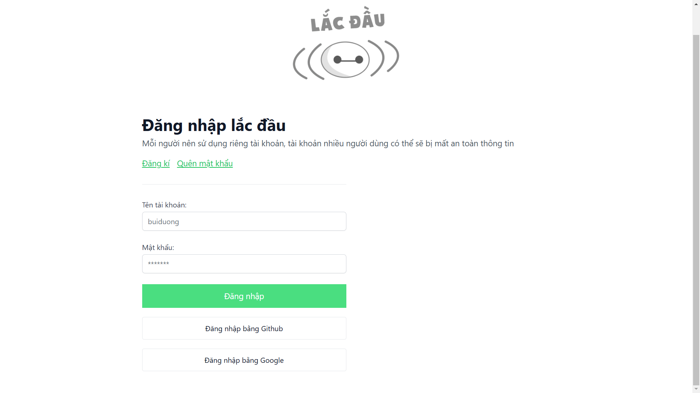
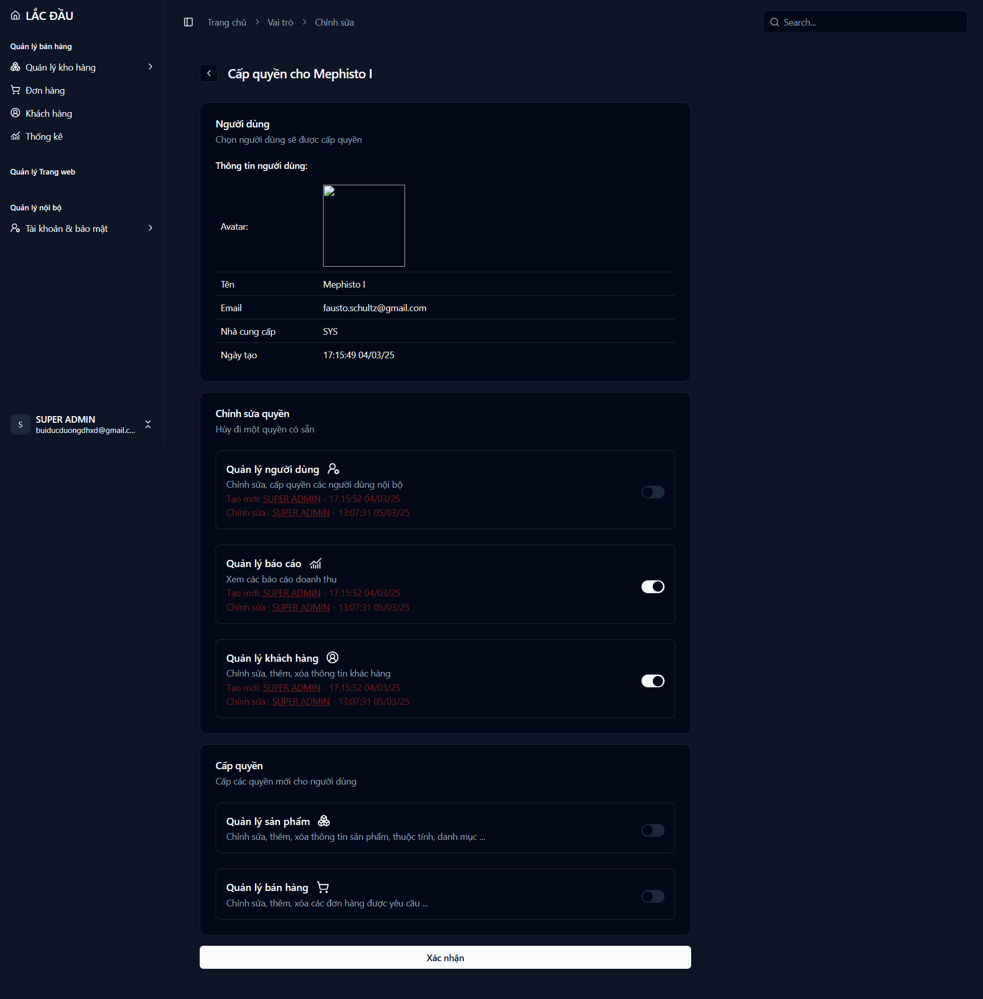
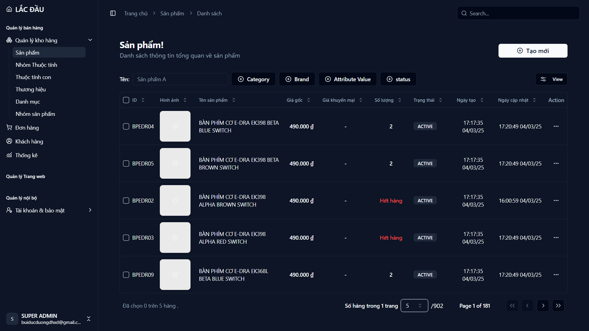
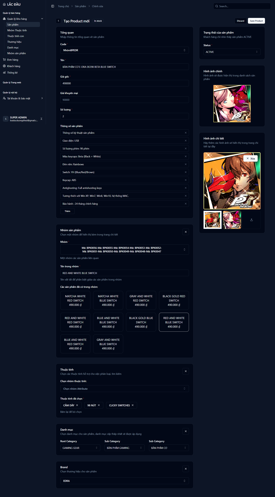
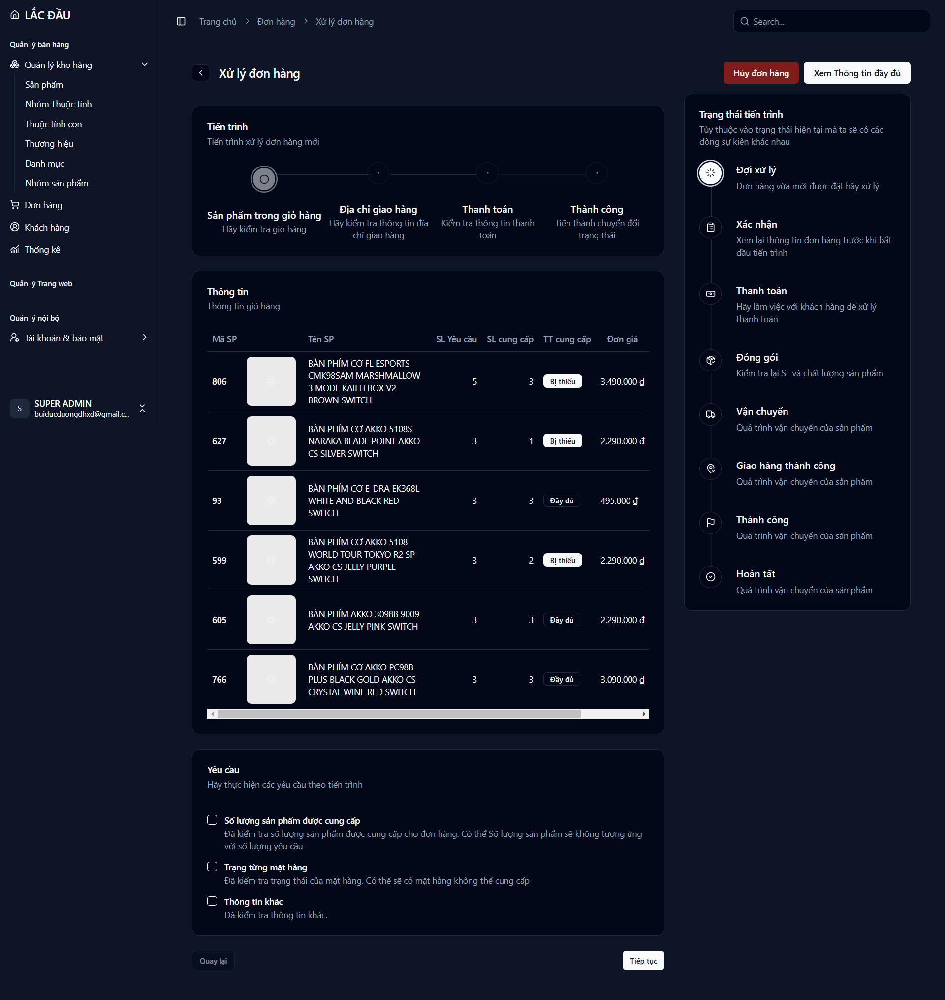
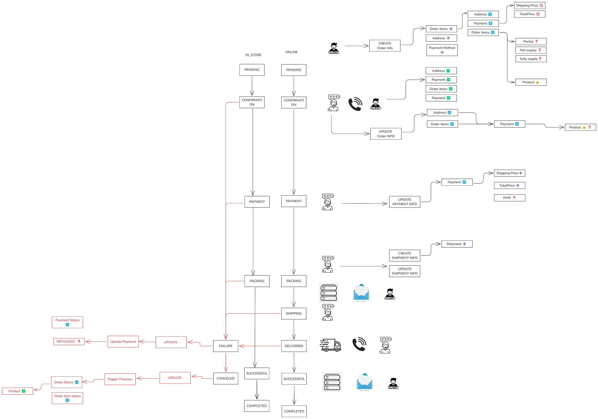

## DỰ ÁN CLONE WEBSITE BÁN HÀNG ONLINE - LACDAU.COM

### 1. Giới thiệu: 
Dự án này là một hệ thống web bán hàng, được phát triển dựa trên mô hình của trang web LacDau.com - một trang thương mại điện tử chuyên cung cấp gaming gear, phụ kiện máy tính, mô hình trang trí và các sản phẩm công nghệ. Mục tiêu của dự án là tạo ra một nền tảng thương mại điện tử đầy đủ chức năng, tối ưu trải nghiệm người dùng và có khả năng mở rộng trong tương lai.

### 2. Kiến trúc hệ thống

#### a. Thành phần
- Client: Giao diện người dùng, nơi khách hàng duyệt sản phẩm, đặt hàng. 
- Dashboard: Trang quản trị, nơi quản lý sản phẩm, đơn hàng, khách hàng.
- Auth: Hệ thống xác thực, quản lý tài khoản và phân quyền.
- Backend: Xử lý logic kinh doanh, quản lý dữ liệu và cung cấp API.

#### b. Đường dẫn dự án
- Trang chủ của web thực sự mà tôi tham khảo: [Lắc Đầu](https://lacdau.com/)
- Trang Giao diện người dùng: [https://lacdau-client.onrender.com/](https://lacdau-client.onrender.com/)
- Trang Quản trị: [https://lacdau-dashboard.onrender.com/](https://lacdau-dashboard.onrender.com/)
- Trang Backend API: [http://lacdau-backend.onrender.com/](http://lacdau-backend.onrender.com/)
- Trang Xác thực người dùng: [http://lacdau-auth.onrender.com/](http://lacdau-auth.onrender.com/)
- Tài khoản ADMIN : ROOT_USER
- Mật khẩu: 1234567890

*Do các server được triển khai trên một nhà cung cấp dịch vụ trực tuyến với gói miễn phí, chúng sẽ tự động dừng hoạt động nếu không có tương tác trong một khoảng thời gian. Khi khởi động lại, có thể mất từ 5-10 phút để server hoạt động trở lại. Để giảm thiểu thời gian chờ, hãy truy cập đồng thời cả 4 đường dẫn để khởi động dự án nhanh hơn.*

#### c. Công nghệ sử dụng

- Backend: SpringBoot (REST API)
- Frontend: NuxtJs (Client) & VueJS (Dashboard)
- Trang đăng xác thực: Thymeleaf (dành riêng cho AUTH server)
- Database: PostgreSQL + Hibernate ORM (Backend và Auth đang sử dụng chung một database)
- Authentication & Authorization: Spring Authorization Server, OAuth2 Client với Github và Google
- Lưu trữ hình ảnh: Cloudinary
- Gửi Email: Gmail SMTP - Spring Framework’s email support

### 3. Luồng hoạt động chính

#### a. Khách hàng
Danh mục sản phẩm Category
- Được phân cấp theo dạng phân cấp (cha - con)
- Quản lý động, linh hoạt trong việc tổ chức và hiển thị sản phẩm

Danh sách sản phẩm
- Hiển thị Danh sách sản phẩm bao gồm cả sản phẩm từ danh mục hiện tại và các danh mục con
- Hệ thống lọc sản phẩm linh hoạt với:
    - **Nhà sản xuất** 
    - **Nhóm thuộc tính - thuộc tính chi tiết**: Được thiết kế linh động, dễ dàng quản lý. Cho phép bổ xung, mở rộng với các mặt hàng khác trong tương lai

Chi tiết sản phẩm
- Hiển thị đầy đủ thông tin chi tiết của sản phẩm.
- Nhóm sản phẩm liên quan, giúp người dùng dễ dàng so sánh và lựa chọn.

Chức năng giỏ hàng
- Hỗ trợ đặt hàng trực tuyến hoàn tất quy trình mua sắm

#### b. Quản trị
- Quản lý sản phẩm: Thêm, bớt, sửa, xóa các sản phẩm và dữ liệu liên quan
- Theo dõi thông tin khách hàng, quản trị viên
- Xử lý đơn hàng: 
    - Xử lý tuần tự đảm bảo tính nhất quán và kiểm soát chặt chẽ, dễ sử dụng
    - Các luồng chính như: **Xử lý Đơn hàng Online**, **Xử lý hủy đơn hàng**, dễ dàng mở rộng trong tương lai - VD: **Xử lý mua tại quán**
    - Chỉ cho phép các thao tác quản trị tại các **trạng thái phù hợp**
    - Ghi log chi tiết theo dõi lịch sử

#### c. Xác thực và phân quyền
- Sử dụng **Auth Server riêng biệt**, quản lý xác thực và phân quyền tập trung
- Các server khác sử dụng thông tin xác thực được cung cấp bởi Auth server để **xác thực, phân quyền nội bộ**
- Quản lý thông tin tài khoản, xác thực email, quên mật khẩu
- Hỗ trợ đằng nhập của các nhà cung cấp Google, Github

### 4. Kết quả đạt được

#### Trang chủ

*Product Carosel dữ liệu giả chỉ để thử nghiệm. Không thêm vào giỏ hàng được*

#### Trang danh sách sản phẩm - Lọc sản phẩm nâng cao

*Hiện tại chưa có dữ liệu hình ảnh cho các sản phẩm, nên sử dụng hình ảnh ngẫu nhiên*

#### Trang chi tiết sản phẩm

#### Trang giỏ hàng

#### Trang xác thực 

#### Trang quản trị - Chức năng phần quyền

#### Trang quản trị - Chức năng quản lý sản phẩm

#### Trang quản trị - Chức năng quản lý đơn hàng

#### Sơ đồ tiến trình xử lý Đơn hàng

- Người dùng tạo một bản ghi `Order` mới -> Trạng thái `PENDING`
- Nhân viên sẽ nhận ra có đơn hàng và sẽ làm việc với Khách hàng trong từng giai đoạn của công việc.
- Một số **hành động thay đổi dữ** liệu chỉ có thể thực hiện trong các trạng thái nhất định
- Server sẽ khóa sản phẩm ngay Khi Bản ghi `Order` được tạo. Và giải phóng nếu sản phẩm nếu thất bại thông qua chu trình `CANCELD`
- Một số dữ liệu của một bản ghi sẽ bị thiếu và chỉ sau mỗi giai đoạn sẽ kiểm tra các dữ liệu trước khi thay đổi trạng thái. Đảm bảo sự nhất quán
